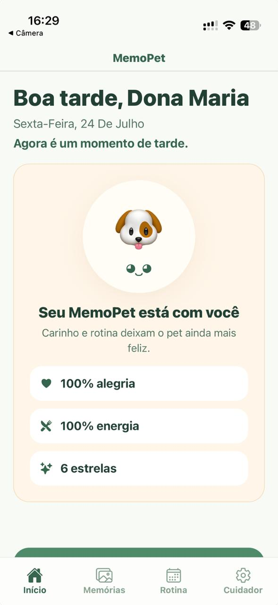
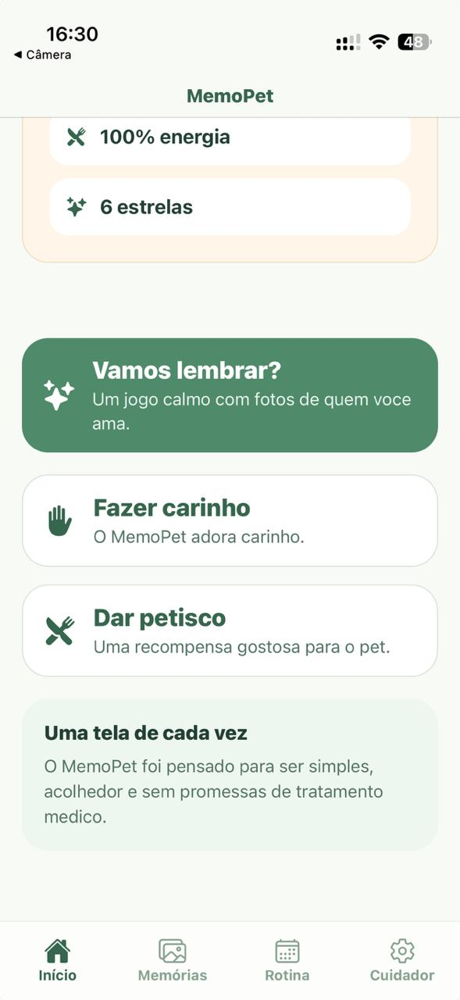
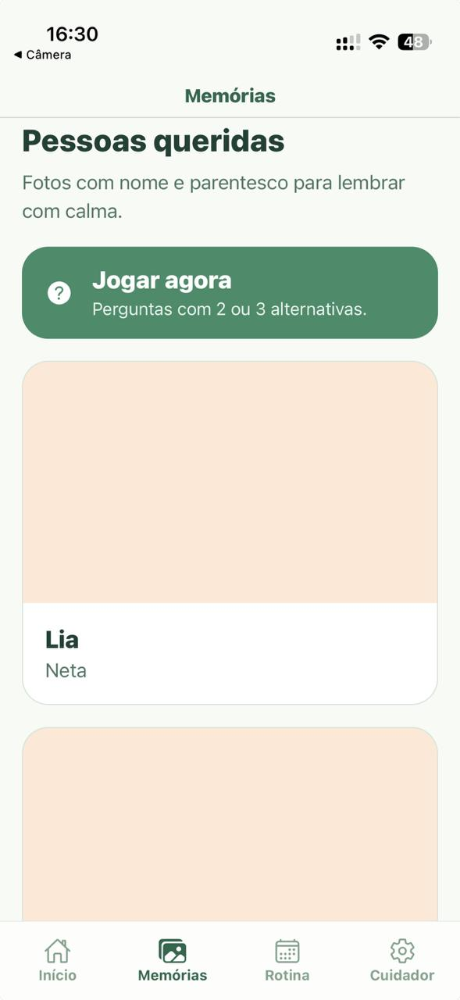
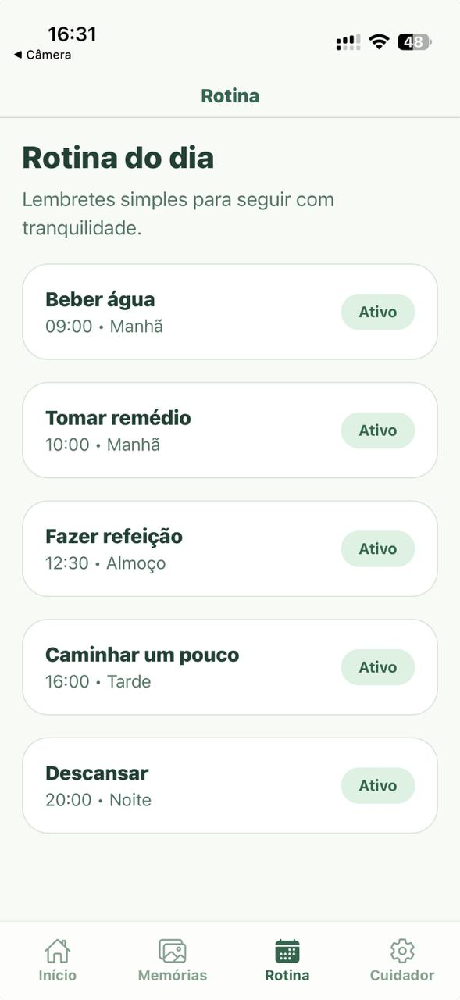

# MemoPet

MemoPet is an **offline-first mobile application built with React Native and Expo** to support affective memory, daily routines, and family connection for people living with mild or moderate Alzheimer's disease.

The MVP focuses on a simple, welcoming, and accessible experience while avoiding medical claims. It combines familiar faces, routine reminders, lightweight memory activities, and a digital pet designed to encourage positive interaction.

## Product Overview

MemoPet was designed around a practical problem: digital products can be difficult to navigate for people with cognitive decline when interfaces are overloaded, interactions are hidden, or flows require too many decisions.

<p align="center">
  
  
  
  
</p>

The app therefore prioritizes:

* Large touch targets
* Readable typography
* Few choices per screen
* Positive and reassuring language
* Simple navigation
* Offline local persistence

## Core Features

* Personalized home screen with a digital pet
* Current date and time-of-day context
* Family memories with photo, name, and relationship
* Simple recognition game with two or three answer options
* Positive reward feedback after interactions
* Daily routine and reminder management
* Caregiver mode for profile and memory setup
* Local data persistence with SQLite
* Global state management with Zustand
* Local scheduled notifications

## Tech Stack

* **React Native**
* **TypeScript**
* **Expo SDK 56**
* **Expo Router**
* **Zustand**
* **Expo SQLite**
* **Expo Notifications**
* **Expo Image Picker**

## Architecture

```text
UI Screens
   |
   v
Reusable Components
   |
   +--> Zustand Store
   |
   +--> Local Services
          |
          +--> SQLite
          +--> Notifications
          +--> Image Picker
```

The current MVP intentionally uses a local-first architecture. It does not require authentication or a remote backend, reducing setup complexity and allowing the main experience to work offline.

## Project Structure

```text
app/
  _layout.tsx
  memory-game.tsx
  (tabs)/
    _layout.tsx
    index.tsx
    memories.tsx
    routine.tsx
    caregiver-settings.tsx

components/
  BigButton.tsx
  MemoryCard.tsx
  PetAvatar.tsx
  RewardAnimation.tsx
  RoutineItem.tsx
  ScreenContainer.tsx

constants/
  theme.ts

lib/
  database.ts
  date.ts
  notifications.ts

stores/
  useAppStore.ts

types/
  index.ts
```

## Local Data Model

SQLite tables are created automatically on first launch:

* `user_profile`
* `memories`
* `reminders`
* `pet_status`

The project also includes initial mock data to make the complete MVP flow easier to test.

## Caregiver Flow

The caregiver mode currently supports:

* Editing the assisted person's name
* Adding family photos, names, and relationships
* Enabling or disabling reminders
* Changing reminder times

## Accessibility and UX Decisions

Accessibility was treated as a product requirement rather than a visual afterthought.

Current design decisions include:

* Larger typography
* Large touch areas
* Limited information density
* Straightforward navigation
* Supportive language
* Positive feedback during recognition activities

The interaction avoids punitive or stressful feedback, providing encouraging responses after both correct and incorrect answers.

## Running the Project

### Requirements

* Node.js 20 recommended
* npm 10+
* Expo-compatible development environment
* Xcode or Android Studio for native simulators, when needed

### Install and run

```bash
npm install
npx expo start
```

Useful commands:

```bash
npm run ios
npm run android
npm run web
npm run typecheck
```

## Development Status

MemoPet is currently an **MVP and portfolio product under active development**.

The current scope intentionally excludes:

* Remote backend services
* User authentication
* AI features
* Medical diagnosis or treatment functionality

The app is not a substitute for medical, therapeutic, or family support.

## Roadmap

Planned improvements include:

* Onboarding flow for caregivers
* Removal and management of old memories
* Original illustrated assets
* Improved visual and audio accessibility feedback
* Interaction history
* Component and database flow tests
* Store-ready iOS and Android builds
* Internationalization
* Evaluation of local data encryption for sensitive information

See the full roadmap in [TODO.md](TODO.md).

## What This Project Demonstrates

* React Native application development
* TypeScript in a mobile codebase
* Offline-first product design
* SQLite persistence
* Global state management
* Local notifications
* Accessibility-oriented UX decisions
* Modular project organization
* Product thinking beyond a basic CRUD application

## License

This project is licensed under the terms described in [LICENSE](LICENSE).
